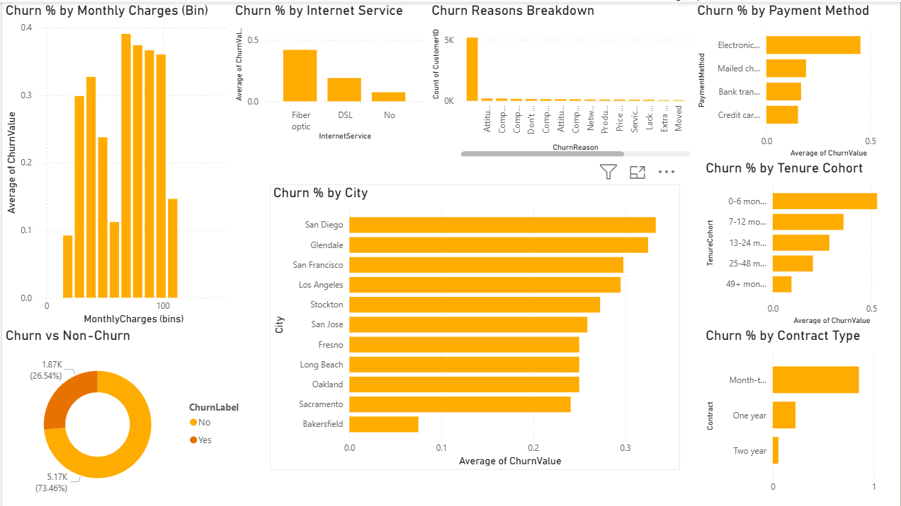

# Customer Churn Descriptive Analytics Project 

### 🚀 Key Takeaways from Churn Analysis

1. Early-tenure customers (0–6 months) churn the most — onboarding is critical.
2. Month-to-month contract users are the biggest churn risk.
3. High MonthlyCharges customers show higher churn — pricing optimization needed.
4. Lack of OnlineSecurity/TechSupport/DeviceProtection increases churn probability.
5. Electronic check payment method shows the highest churn rates.

## 📊 Customer Churn Dashboard

### Full Dashboard

